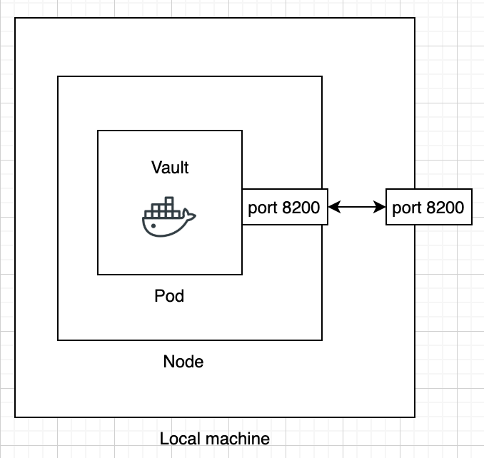

University: [ITMO University](https://itmo.ru/ru/)  
Faculty: [FICT](https://fict.itmo.ru)  
Course: [Introduction to distributed technologies](https://github.com/itmo-ict-faculty/introduction-to-distributed-technologies)  
Year: 2024/2025
Group: K4110c  
Author: Льдоков Роман Александрович
Lab: Lab1  
Date of create: 02.01.2025  
Date of finished: 03.01.2025

# Лабораторная работа №1 "Установка Docker и Minikube, мой первый манифест."

## Цель работы
Ознакомиться с инструментами Minikube и Docker, развернуть свой первый "под".

## Ход работы

### Диаграмма

