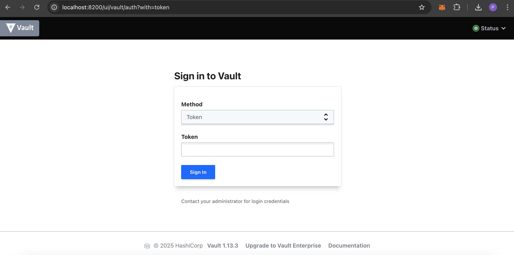

University: [ITMO University](https://itmo.ru/ru/)  
Faculty: [FICT](https://fict.itmo.ru)  
Course: [Introduction to distributed technologies](https://github.com/itmo-ict-faculty/introduction-to-distributed-technologies)  
Year: 2024/2025  
Group: K4110c  
Author: Льдоков Роман Александрович  
Lab: Lab1  
Date of create: 02.01.2025  
Date of finished: 03.01.2025  

# Лабораторная работа №1 "Установка Docker и Minikube, мой первый манифест."

## Цель работы
Ознакомиться с инструментами Minikube и Docker, развернуть свой первый "под".

## Ход работы

### 1. На локальную машину были уставновлены Docker и Minikube

### 2. Развернут minikube cluster

```
minikube start
```


### 3. Развернута "пода" HashiCorp Vault с использованием написанного манифеста

```
apiVersion: v1
kind: Pod
metadata:
  name: vault
  namespace: default
  labels:
    app: vault
spec:
  containers:
  - name: vault
    image: vault:1.13.3
    ports:
    - containerPort: 8200
```


### 4. Выполнен проброс портов

```
kubectl port-forward pod/vault 8200:8200
```


### 5. Открыта страница в браузе по ссылке http://localhost:8200



### 6. В конце вывода команды найден токен

```
kubectl logs vault
```


### 7. Успешно пройдена авторизация


### Диаграмма


