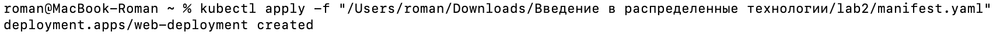
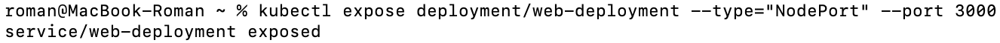
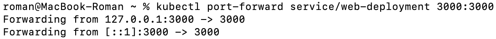
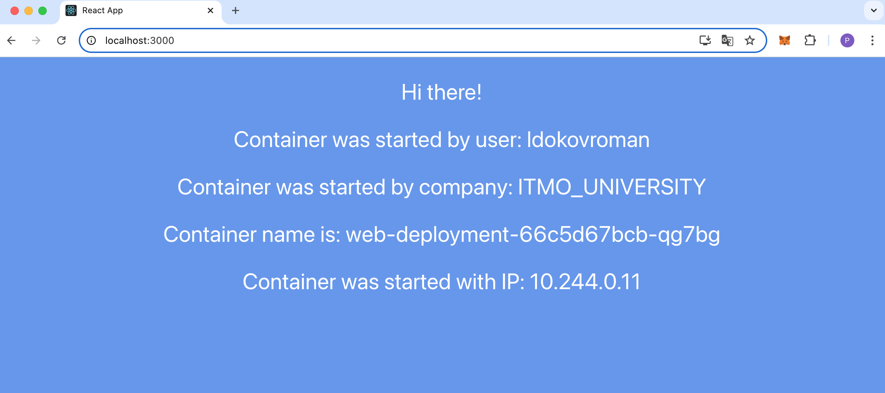
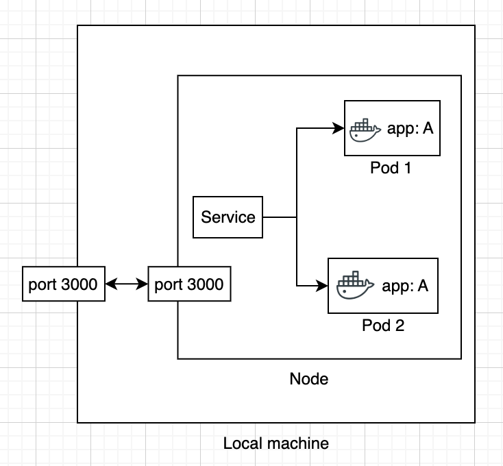

University: [ITMO University](https://itmo.ru/ru/)  
Faculty: [FICT](https://fict.itmo.ru)  
Course: [Introduction to distributed technologies](https://github.com/itmo-ict-faculty/introduction-to-distributed-technologies)  
Year: 2024/2025  
Group: K4110c  
Author: Льдоков Роман Александрович  
Lab: Lab2 
Date of create: 03.01.2025  
Date of finished: 03.01.2025  

# Лабораторная работа №2 "Развертывание веб сервиса в Minikube, доступ к веб интерфейсу сервиса. Мониторинг сервиса."

## Цель работы
Ознакомиться с типами "контроллеров" развертывания контейнеров, ознакомится с сетевыми сервисами и развернуть свое веб приложение.

## Ход работы

### 1. Создан deployment с 2 репликами контейнера ifilyaninitmo/itdt-contained-frontend:master и переданными переменными в эти реплики: REACT_APP_USERNAME, REACT_APP_COMPANY_NAME

```
apiVersion: apps/v1
kind: Deployment
metadata:
  name: web-deployment
  namespace: default
  labels:
    app: web
spec:
  replicas: 2
  selector:
    matchLabels:
      app: web
  template:
    metadata:
      labels:
        app: web
    spec:
      containers:
      - name: web-deployment
        image: ifilyaninitmo/itdt-contained-frontend:master
        env:
        - name: REACT_APP_USERNAME
          value: ldokovroman
        - name: REACT_APP_COMPANY_NAME
          value: ITMO_UNIVERSITY
```



### 2. Создать сервис, через который будет доступ на эти "поды"

```
kubectl expose deployment/web-deployment --type="NodePort" --port 3000
```



### 3. Настроен проброс портов

```
kubectl port-forward service/web-deployment 3000:3000
```



### 6. Проверен результат на странице браузера



### Диаграмма


