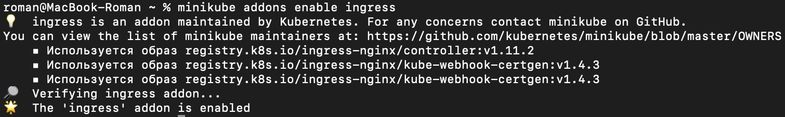

University: [ITMO University](https://itmo.ru/ru/)  
Faculty: [FICT](https://fict.itmo.ru)  
Course: [Introduction to distributed technologies](https://github.com/itmo-ict-faculty/introduction-to-distributed-technologies)  
Year: 2024/2025  
Group: K4110c  
Author: Льдоков Роман Александрович  
Lab: Lab3  
Date of create: 03.01.2025  
Date of finished: 04.01.2025  

# Лабораторная работа №3 "Сертификаты и "секреты" в Minikube, безопасное хранение данных."

## Цель работы
Познакомиться с сертификатами и "секретами" в Minikube, правилами безопасного хранения данных в Minikube.

## Ход работы

### 1. Создан `configMap` с переменными: `REACT_APP_USERNAME`, `REACT_APP_COMPANY_NAME`

```
kubectl create configmap webconfigmap --from-literal=REACT_APP_USERNAME=ldokovroman --from-literal=REACT_APP_COMPANY_NAME=ITMO_UNIVERSITY
```


### 2. Создан deployment с 2 репликами контейнера ifilyaninitmo/itdt-contained-frontend:master с указанием ссылки на ранее созданный configMap

```
apiVersion: apps/v1
kind: Deployment
metadata:
  name: web-deployment
  namespace: default
  labels:
    app: web
spec:
  replicas: 2
  selector:
    matchLabels:
      app: web
  template:
    metadata:
      labels:
        app: web
    spec:
      containers:
      - name: web-deployment
        image: ifilyaninitmo/itdt-contained-frontend:master
        envFrom:
          - configMapRef:
              name: webconfigmap
```


### 3. Создан сервис, через который будет доступ на эти "поды"

```
kubectl expose deployment/web-deployment --type="NodePort" --port 3000
```


### 4. Включен Ingress

```
minikube addons enable ingress
```



### 5. Сгенерирован TLS-сертификат при помощи протокола openssl

```
openssl req -new -newkey rsa:4096 -x509 -sha256 -nodes -out WebCertificate.crt -keyout web.key
```


### 6. Импортирован сертификат в minikube

```
kubectl create secret tls web-certificate --key web.key --cert WebCertificate.crt
```


### 7. Создан ingress в minikube, где указан ранее импортированный сертификат, FQDN, по которому будет открываться веб-страница, и имя сервиса, который также был создан ранее

```
apiVersion: networking.k8s.io/v1
kind: Ingress
metadata:
  name: web-deployment
  namespace: default
spec:
  tls:
  - hosts:
      - web.info
    secretName: web-certificate
  rules:
  - host: web.info
    http:
      paths:
      - path: /
        pathType: Prefix
        backend:
          service:
            name: web-deployment
            port:
              number: 3000
```


### Диаграмма


