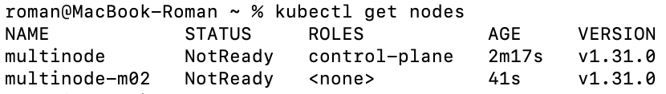
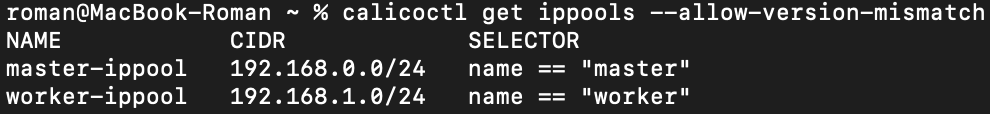

University: [ITMO University](https://itmo.ru/ru/)  
Faculty: [FICT](https://fict.itmo.ru)  
Course: [Introduction to distributed technologies](https://github.com/itmo-ict-faculty/introduction-to-distributed-technologies)  
Year: 2024/2025  
Group: K4110c  
Author: Льдоков Роман Александрович  
Lab: Lab4  
Date of create: 04.01.2025  
Date of finished: 05.01.2025  

# Лабораторная работа №4 "Сети связи в Minikube, CNI и CoreDNS"

## Цель работы
Познакомиться с CNI Calico и функцией IPAM Plugin, изучить особенности работы CNI и CoreDNS.

## Ход работы

### 1. При запуске minikube установлен плагин `CNI=calico` и режим работы `Multi-Node Clusters`

```
minikube start --network-plugin=cni --cni=calico --nodes 2 -p multinode
```


### 2. Проверено количество нод

```
kubectl get nodes
```



### 3. Проверена уставнока CNI плагина Calico

```
kubectl get pods -l k8s-app=calico-node -A
```


### 4. Для запущеных ранее нод указаны метки

```
kubectl label node multinode name=master
```

```
kubectl label node multinode-m02 name=worker
```


### 5. Удален пул адресов по умолчанию

```
calicoctl delete ippools default-ipv4-ippool
```

### 6. Разработан манифест для Calico, который на основе ранее указанных меток назначает IP адреса "подам", исходя из пулов IP адресов которые, вы указаны в манифесте

```
apiVersion: projectcalico.org/v3
kind: IPPool
metadata:
  name: master-ippool
spec:
  cidr: 192.168.0.0/24
  ipipMode: Always
  natOutgoing: true
  nodeSelector: name == "master"
---
apiVersion: projectcalico.org/v3
kind: IPPool
metadata:
  name: worker-ippool
spec:
  cidr: 192.168.1.0/24
  ipipMode: Always
  natOutgoing: true
  nodeSelector: name == "worker"
```


### 7. Проверены созданные пулы адресов

```
calicoctl get ippool -o wide --allow-version-mismatch
```



### 8. Создан `configMap` с переменными `REACT_APP_USERNAME` и `REACT_APP_COMPANY_NAME`

```
kubectl create configmap webconfigmap --from-literal=REACT_APP_USERNAME=ldokovroman --from-literal=REACT_APP_COMPANY_NAME=ITMO_UNIVERSITY
```


### 9. Создан deployment с 2 репликами контейнера ifilyaninitmo/itdt-contained-frontend:master с указанием ссылки на ранее созданный `configMap`

```
apiVersion: apps/v1
kind: Deployment
metadata:
  name: web-deployment
  namespace: default
  labels:
    app: web
spec:
  replicas: 2
  selector:
    matchLabels:
      app: web
  template:
    metadata:
      labels:
        app: web
    spec:
      containers:
      - name: web-deployment
        image: ifilyaninitmo/itdt-contained-frontend:master
        envFrom:
          - configMapRef:
              name: webconfigmap
```


### 10.  Создан сервис, через который будет доступ на эти "поды"

```
kubectl expose deployment web-deployment --type=NodePort --port=3000
```


### 11.  Настроен проброс портов

```
kubectl port-forward service/web-deployment 3000:3000
```


### 12.  Открыта страница в браузере с веб-приложением


### 13.  Проверены выданные IP-адреса "под"

```
kubectl get pods -o wide
```


### 14.  С "поды" master была пропингована "пода" worker

```
kubectl exec -it web-deployment-6c9bfbbfc7-lb596 -- ping 192.168.1.129
```


### Диаграмма


